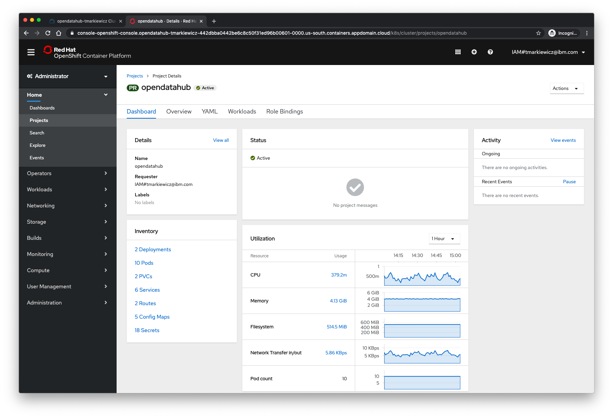

# Installing Open Data Hub on IBM Cloud
What is [Open Data Hub](https://opendatahub.io/)?

"Open Data Hub is a blueprint for building an AI as a service platform on Red Hat's Kubernetes-based OpenShift® Container Platform and Ceph Object Storage. It inherits from upstream efforts such as Kafka/Strimzi and Kubeflow, and is the foundation for Red Hat's internal data science and AI platform. Data scientists can create models using Jupyter notebooks, and select from popular tools such as TensorFlow™, scikit-learn, Apache Spark™ and more for developing models. Teams can spend more time solving critical business needs and less on installing and maintaining infrastructure with the Open Data Hub.

Open Data Hub is a meta-project that integrates open source projects into a practical solution. It aims to foster collaboration between communities, vendors, user-enterprises, and academics following open source best practices. The open source community can experiment and develop intelligent applications without incurring high costs and having to master the complexity of modern machine learning and artificial intelligence software stacks.""

The ODH site has a tutorial that I based this one on, but for clarity I added additional instructions and context on many of the steps. For reference, the official getting started tutorial is here: https://opendatahub.io/docs/getting-started/quick-installation.html

end-to-end AI/ML platform, aims to provide an open-source tool fro every step of the AI/ML workflow
provide all the tools for all the users of an AI/ML platform
based on all open source projects such as Jupyterhub, Apache Spark, Seldon, Prometheus, Grafana and Argo
https://www.redhat.com/en/blog/culture-of-innovation-open-data-hub


Open Data Hub Project is a functional architecture based on OpenShift, Red Hat Ceph Storage, Red Hat AMQ Streams, and several upstream open source projects to help build an open ML platform with the necessary ML tooling.
https://www.openshift.com/learn/topics/ai-ml?extIdCarryOver=true&sc_cid=7013a000002DXF7AAO

Videos: https://www.youtube.com/playlist?list=PLaR6Rq6Z4Iqcg2znnClv-xbj93Q_wcY8L


"Open Data Hub project, a reference architecture for an AI and Machine Learning as a service platform for OpenShift built using open source tools.""


Some use cases for open Data Hub include:
* data science experimentation
* TODO: add more examples

## Requirements
* IBM Cloud account


## Overview
In this tutorial, we'll walk through installing Open Data Hub on Red Hat OpenShift all through the IBM Cloud.

1. Install Red Hat OpenShift from IBM Cloud
2. Install Open Data Hub on OpenShift

## Red Hat OpenShift
[OpenShift](https://www.openshift.com/) allows developers to develop, deploy, and run containerized applications. It enables them to take advantage of both containerized applications and orchestration without having to the know the details. They're then free to focus on code instead of spending time writing Dockerfiles and running docker builds. The core of the OpenShift platform are containers and orchestration.

Red Hat OpenShift is now the primary container environment for all IBM's hybrid cloud offerings and has become the [preferred Kubernetes platform](https://blog.openshift.com/ibm-is-bringing-red-hat-openshift-to-its-platforms/) for IBM to address the needs of increasingly critical container workloads.


## Steps
First, sign in to the [IBM Cloud](https://cloud.ibm.com) and then navigate to the [catalog](https://cloud.ibm.com/catalog).


### Install an OpenShift cluster
The first step to creating an instance of Open Data Hub is to install a Red Hat OpenShift cluster. I recommend using OpenShift v4.x as opposed to v3.x as the operators needed in the steps below are already included.

Click on the catalog tile labeled **Red Hat OpenShift Cluster**


Next, we need to configure the Red Hat OpenShift Cluster:


* Select "Single zone" for availability under the Location section
* Set the OpenShift version to beta version 4.x


* For the flavor of nodes for the worker, select `4 vCPUs 16GB RAM`
* Leave the worker nodes set to 3


* Now click on **Create cluster**
* Once your cluster is created, you can view the resource dashboard on IBM Cloud.


* To view the OpenShift web console, click the button for **OpenShift web console** and this will launch the web console in a new browser tab.


* You can also sign into the cluster via the command line. Once in the OpenShift web console, click on the menu in the upper right corner of the screen. Select **Copy Login Command**. Paste this into your Terminal and hit enter.

Once the cluster install has fully completed, open the web console. For example:
```
https://console-openshift-console.opendatahub-tmarkiewicz-442dbba0442be6c8c50f31ed96b00601-0000.us-south.containers.appdomain.cloud/dashboards
```

Congrats, you now have a working Red Hat OpenShift cluster! Let's move on to installing Open Data Hub on this cluster.


### Install Open Data Hub
Login to the OpenShift cluster you just created.


Click on the **Projects** menu item.


Create a new project for your installation of Open Data Hub. Name the project `odh` with a display name of `Open Data Hub`




Next we need to install Open Data Hub as an operator from the OperatorHub. Navigate to the OperatorHub under the Operators menu item in the main left side nav.


Filter for Open Data Hub or select Big Data and look for the icon for Open Data Hub.


Click on the tile for Open Data Hub and then click the Install button (and follow the installation instructions to install the Open Data Hub operator).

Once its done installing, you can find the Open Data Hub under Installed Operators.


To view the status of the Open Data Hub operator installation, find the Open Data Hub Operator under Operators -> Installed Operators (inside the namespace you created earlier). Once the **STATUS** field displays "InstallSucceeded", you can proceed to create a new Open Data Hub deployment.


### Create a New Open Data Hub Deployment
Click on the Open Data Hub Operator to bring up the detail.
* Click on Open Data Hub Operator
* Click Create Instance to create a new deployment.
* Click Create. If you accepted the default name, this will trigger an Open Data Hub deployment named example-opendatahub with JupyterHub and Spark.
* Verify the installation by viewing the Open Data Hub tab within the operator details. You should see **example-opendatahub** listed.
* Verify the installation by viewing the project workload. Projects -> project name - Workloads. JupyterHub and Spark should all be running.


### Basic tutorial: Exploring JupyterHub and Spark
The following steps follow the basic tutorial listed on the Open Data Hub site here: https://opendatahub.io/docs/getting-started/basic-tutorial.html

* First, find the route to JupyterHub. Within your Open Data Hub Project click on Networking -> Routes


* Next, click on the location for JupyterHub
* A new tab will open with a single orange button. Click on `Sign in with OpenShift`


* Sign in using your OpenShift credentials if you're not auto signed-in.

TODO: need a better screenshot as mine already existed: Spawn a new server with spark functionality. (e.g. s2i-spark-minimal-notebook:3.6)

* Now we need to create a new Python 3 notebook


* Copy the following code to test a basic Spark connection:
```
from pyspark.sql import SparkSession, SQLContext
import os
import socket

# Add the necessary Hadoop and AWS jars to access Ceph from Spark
# Can be omitted if s3 storage access is not required
os.environ['PYSPARK_SUBMIT_ARGS'] = f"--conf spark.jars.ivy={os.environ['HOME']} --packages org.apache.hadoop:hadoop-aws:2.7.3,com.amazonaws:aws-java-sdk:1.7.4 pyspark-shell"

# create a spark session
spark_cluster_url = f"spark://{os.environ['SPARK_CLUSTER']}:7077"
spark = SparkSession.builder.master(spark_cluster_url).getOrCreate()

# test your spark connection
spark.range(5, numPartitions=5).rdd.map(lambda x: socket.gethostname()).distinct().collect()
```


* Now try runnnig the notebook. If successful, you should see the output similar to the following:
```
['jupyterhub-nb-kube-3aadmin']
```

NOTE: If you have issues with tutorial code, leave default YAML settings, and then select the smallest available container size when spawning the Jupytper container.

```
from pyspark.sql import SparkSession, SQLContext
import os
import socket

# Add the necessary Hadoop and AWS jars to access Ceph from Spark
# Can be omitted if s3 storage access is not required
os.environ['PYSPARK_SUBMIT_ARGS'] = f"--conf spark.jars.ivy={os.environ['HOME']} --packages org.apache.hadoop:hadoop-aws:2.7.3,com.amazonaws:aws-java-sdk:1.7.4 pyspark-shell"

# create a spark session
spark_cluster_url = f"spark://{os.environ['SPARK_CLUSTER']}:7077"
spark = SparkSession.builder.master(spark_cluster_url).getOrCreate()

# test your spark connection
spark.range(5, numPartitions=5).rdd.map(lambda x: socket.gethostname()).distinct().collect()
```

For the next step (storage), you'll need to change the following settings:
```
s3_region = 'us-east-1' # fill in for AWS, blank for Ceph
s3_endpoint_url = 'https://s3.amazonaws.com'
s3_bucket = 'opendatahub-ibm'
```

## Summary
TODO: add summary

## Next steps
Here are some additional steps to try now that you've completed the basic tutorial:
* Continue on with the basic tutorial on Object Storage and then Spark + Object Storage here: https://opendatahub.io/docs/getting-started/basic-tutorial.html
* Then move on to the advanced tutorial here: https://opendatahub.io/docs/advanced-tutorials/data-exploration.html
